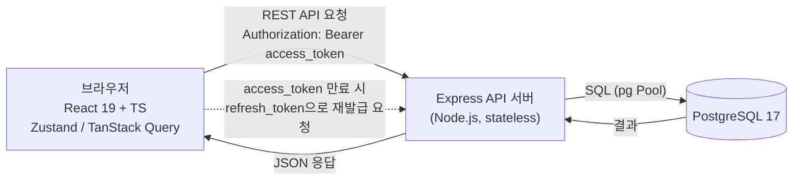
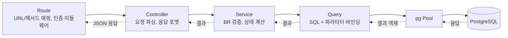
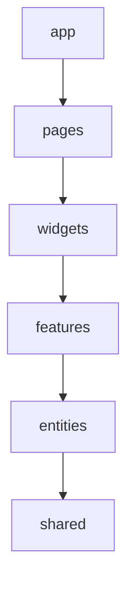
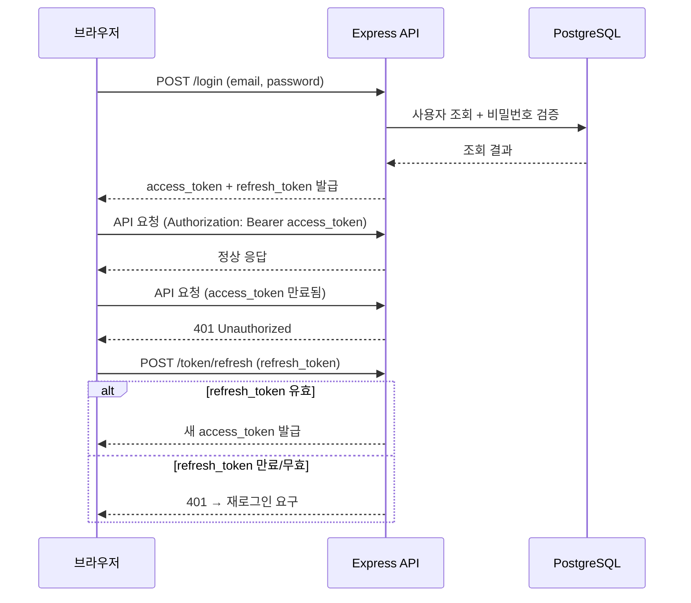

# my-todoList 아키텍처 다이어그램

## 버전 이력

| 버전 | 날짜 | 변경 내용 |
|---|---|---|
| 0.1 | 2026-08-26 | 최초 작성 (PRD v0.3, 프로젝트 구조 설계 원칙 v0.2 기반) |
| 0.2 | 2026-08-26 | JWT 인증 흐름도(4절) 추가 |

## 1. 전체 시스템 구성도

브라우저(React)가 Express API 서버와 REST로 통신하고, 서버는 PostgreSQL에 접근한다. 인증은 JWT(access/refresh) 기반이며 서버는 세션을 갖지 않는다.

## 2. 백엔드 요청 처리 흐름

Route → Controller → Service(BR 검증) → Query(SQL) → pg Pool → DB 순으로 단방향으로 처리한다.

## 3. 프론트엔드 레이어 구성 (FSD)

상위 레이어는 하위 레이어만 참조할 수 있다(역방향/동일 레이어 간 직접 참조 금지).

## 4. JWT 인증 흐름

로그인 시 access_token(단명)/refresh_token(장명)을 함께 발급하고, access_token 만료 시 refresh_token으로 재발급한다. refresh_token도 만료되면 재로그인한다.

