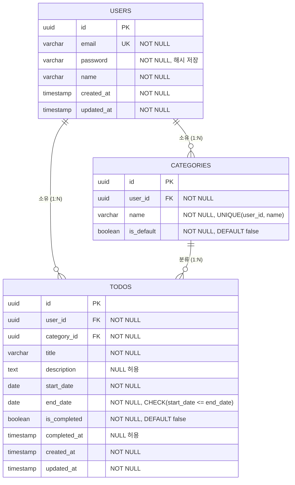

# my-todoList ERD

## 버전 이력

| 버전 | 날짜 | 변경 내용 |
|---|---|---|
| 0.1 | 2026-08-26 | 최초 작성 (도메인 정의서 v0.3, 프로젝트 구조 설계 원칙 v0.2 기반) |

## 0. 문서 목적

- `1-domain-definition.md`(v0.3) 3장의 User/Category/Todo 엔티티를 `5-project-principle.md`(v0.2)의 백엔드 원칙(SQL 직접 작성, PostgreSQL 17, DB 컬럼 snake_case)에 맞춰 DB 스키마 수준으로 정의한다.
- 도메인 정의서에 없는 테이블(세션, 로그 등)은 추가하지 않는다.

## 1. ERD

## 2. 테이블 정의

### 2.1 users

| 컬럼 | 타입 | 제약 |
|---|---|---|
| id | uuid | PK, DEFAULT gen_random_uuid() |
| email | varchar(255) | NOT NULL, UNIQUE |
| password | varchar(255) | NOT NULL (bcrypt 등 해시값 저장, 평문 금지) |
| name | varchar(50) | NOT NULL |
| created_at | timestamp | NOT NULL, DEFAULT now() |
| updated_at | timestamp | NOT NULL, DEFAULT now() |

### 2.2 categories

| 컬럼 | 타입 | 제약 |
|---|---|---|
| id | uuid | PK, DEFAULT gen_random_uuid() |
| user_id | uuid | NOT NULL, FK → users(id) ON DELETE CASCADE |
| name | varchar(50) | NOT NULL |
| is_default | boolean | NOT NULL, DEFAULT false |

- `UNIQUE (user_id, name)`: 카테고리 이름은 사용자별로 고유해야 한다(도메인 정의서 3.2, BR-09).
- `is_default = true`인 카테고리(사용자당 1개, 회원가입 시 자동 생성, BR-02)는 애플리케이션(Service) 레벨에서 삭제를 금지한다(BR-08). 일반 카테고리 삭제 시 소속 Todo는 삭제되지 않고 해당 사용자의 기본 카테고리로 이동한다(BR-08, 트랜잭션 처리).

### 2.3 todos

| 컬럼 | 타입 | 제약 |
|---|---|---|
| id | uuid | PK, DEFAULT gen_random_uuid() |
| user_id | uuid | NOT NULL, FK → users(id) ON DELETE CASCADE |
| category_id | uuid | NOT NULL, FK → categories(id) ON DELETE RESTRICT |
| title | varchar(200) | NOT NULL |
| description | text | NULL 허용 |
| start_date | date | NOT NULL |
| end_date | date | NOT NULL |
| is_completed | boolean | NOT NULL, DEFAULT false |
| completed_at | timestamp | NULL 허용 (is_completed=true 전환 시 기록) |
| created_at | timestamp | NOT NULL, DEFAULT now() |
| updated_at | timestamp | NOT NULL, DEFAULT now() |

- `CHECK (start_date <= end_date)`: 시작일은 종료일보다 늦을 수 없다(BR-04).
- `category_id`는 `ON DELETE RESTRICT`로 설정한다. 일반 카테고리 삭제는 DB 레벨 CASCADE가 아닌 Service 트랜잭션에서 Todo를 기본 카테고리로 먼저 이동시킨 뒤 카테고리를 삭제한다(BR-08).
- 소유권 검증(BR-05)은 조회/수정/삭제 쿼리에서 `WHERE id = $1 AND user_id = $2` 조건으로 처리하며, 별도 컬럼/제약은 두지 않는다.
- 상태(Status: 시작 전/진행중/완료/지연)는 저장 컬럼이 아니라 `start_date`, `end_date`, `is_completed`와 조회 시점을 기준으로 계산되는 파생값이다(도메인 정의서 4장).

## 3. 인덱스

| 테이블 | 인덱스 | 목적 |
|---|---|---|
| users | UNIQUE(email) | 로그인 식별자 조회, BR-07 |
| categories | UNIQUE(user_id, name) | 사용자별 카테고리 이름 중복 방지, BR-09 |
| categories | INDEX(user_id) | 사용자별 카테고리 목록 조회 |
| todos | INDEX(user_id) | 사용자별 할일 목록 조회 |
| todos | INDEX(category_id) | 카테고리별 필터링, BR-06 |
